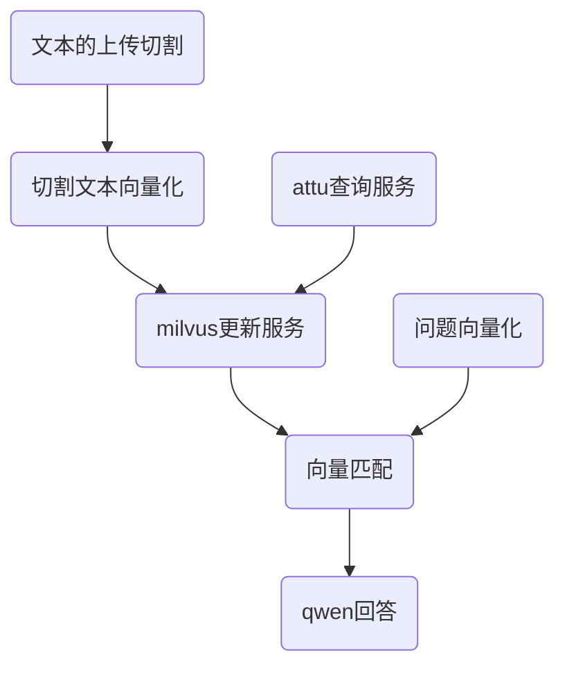

# llm-with-milvus

```mermaid
graph TB
  A(milvus更新服务)
  B(attu查询服务)
  C(文本的上传切割)
  D(切割文本向量化)
  E(向量匹配)
  F(qwen回答)
  G(问题向量化)
  C --> D
  D --> A
  B --> A
  A --> E
  G --> E
  E --> F
  
  

```
